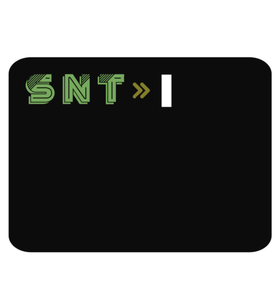

# SNT

snt - Simple new terminal support for BiDi languages 
## Installation
```bash
git clone https://github.com/kamal-elbalaidi/snt.git
```

then
```bash
cd snt
sudo make install clean
```
## Uninstallation
```bash
sudo make uninstall
```
## License

[MIT](LICENSE)
